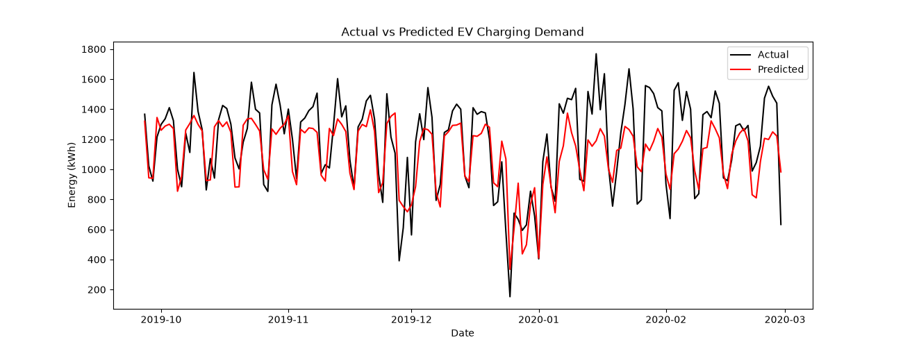
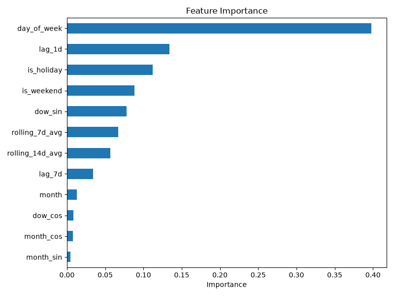
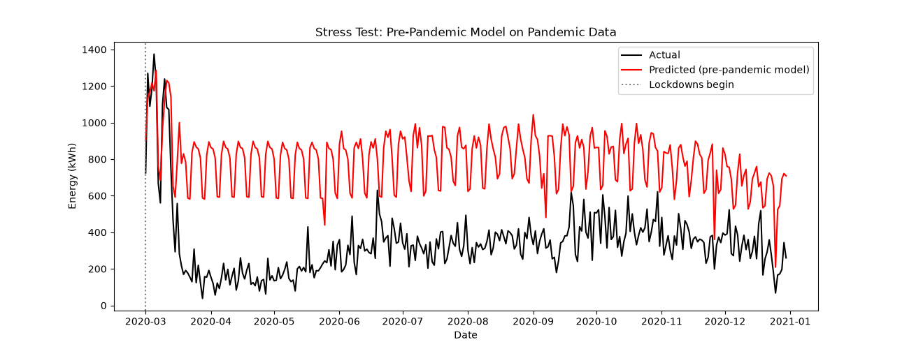

# EV Charging Demand Forecasting

A time-series ML pipeline that forecasts daily EV charging demand from
real public charging session data (City of Palo Alto, 2018–2020),
benchmarked against a seasonal-naive baseline.

## The data

[EV Charging Sessions dataset](https://www.kaggle.com/datasets/sanskritirai31/ev-charging-with-weather-and-traffic-dataset)
— 102,781 real charging sessions across 45 public stations in Palo Alto,
CA, from January 2018 to December 2020. Note: despite the dataset's title
mentioning weather and traffic, the actual file only contains session-level
charging data (timestamps, energy delivered, duration, station info,
fees) — no weather or traffic columns. This project works with what's
actually in the data rather than features that were only described, not
included.

## Pipeline

1. **Aggregation** — collapsed 102,781 individual charging sessions into
   a daily citywide demand time series (total energy delivered, session
   count, unique stations used per day)
2. **Feature engineering** — calendar features (day of week, month, US
   holidays, cyclical sin/cos encodings) and lag/rolling features
   (yesterday's demand, same day last week, 7- and 14-day rolling
   averages, all computed without leaking future information)
3. **Baseline** — a seasonal-naive model: predict today's demand equals
   demand on the same weekday last week
4. **ML model** — a Gradient Boosting Regressor, evaluated with a
   time-based train/test split (never trained on future data to predict
   the past)

## Results (pre-pandemic test period)

Evaluated on Sept 2019–Feb 2020, a stable pre-pandemic period:

| Model | MAE (kWh) | RMSE (kWh) |
|---|---|---|
| Seasonal-naive baseline | 203.4 | 296.5 |
| Gradient Boosting | **155.5** | **192.6** |

The ML model reduces average error by about 24% over the baseline. The
most important features were `day_of_week`, `lag_1d`, and `is_holiday` —
consistent with commuter-driven charging behavior that dips on weekends
and holidays and carries strong day-to-day momentum.

One consistent pattern in the predictions: they track the actual demand's
shape closely but run slightly low overall. This is a known behavior of
tree-based models like Gradient Boosting — they predict by averaging over
similar training examples, so when demand is trending upward (as it was
here through 2018–2019), predictions lag slightly behind the trend.




## The pandemic stress test

Rather than only evaluating on stable, "normal" data, I deliberately
tested how the pre-pandemic-trained model performs when the world changes
underneath it. I applied the same model — with no retraining — to
March–December 2020, when COVID-19 stay-at-home orders hit Palo Alto and
charging demand collapsed almost overnight, never recovering within this
dataset's window.

| Metric | Pre-pandemic test | Pandemic stress test |
|---|---|---|
| MAE | 155.5 kWh | 461.2 kWh |
| RMSE | 192.6 kWh | 495.6 kWh |

Error nearly tripled. The model learned what a normal week looks like,
but it has no way of knowing when the rules of "normal" suddenly stop
applying — like a global pandemic — so it keeps confidently predicting
the old pattern well after it's stopped being true.



This is a meaningful finding rather than a failure: the model didn't
break randomly, it broke in a specific, explainable way — still
reproducing the pre-pandemic weekly pattern almost exactly. That's a sign
it learned real structure in the data rather than memorizing noise, it
just was never told the structure had changed.

## What I'd do differently in production

A real deployed system would need drift detection: continuously
monitoring whether the model's recent prediction errors are creeping
above what's normal, and automatically flagging it for a human to look
at (or triggering a retrain) rather than silently continuing to make
confidently wrong predictions during a regime shift.

## Project structure

```
ev-charging/
├── data/
│   ├── EVcharging.csv        # raw session data
│   ├── daily_demand.csv      # aggregated daily time series
│   └── features.csv          # engineered features, ready for modeling
├── src/
│   ├── build_daily_demand.py # raw sessions -> daily time series
│   ├── features.py           # calendar + lag/rolling feature engineering
│   ├── baseline_model.py     # seasonal-naive baseline
│   └── ml_model.py           # training, evaluation, plots, stress test
├── outputs/                  # generated plots
└── README.md
```

## Running it

```bash
python3 -m venv venv
source venv/bin/activate
pip install pandas numpy scikit-learn matplotlib

cd src
python3 build_daily_demand.py
python3 features.py
python3 baseline_model.py
python3 ml_model.py
```

## Possible extensions

- Pull in real historical weather data (e.g. Open-Meteo or Meteostat) —
  the dataset's own title suggests this was the original intent
- Automated drift detection instead of a fixed train/test split
- Per-station models instead of a citywide aggregate
